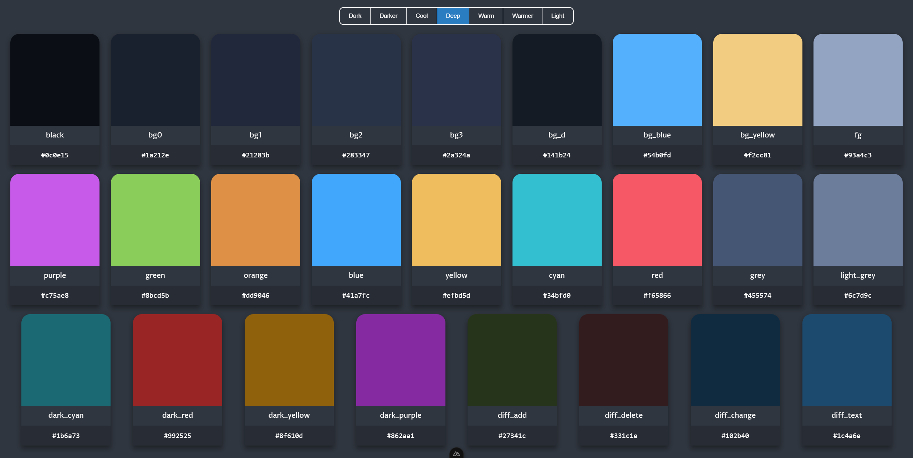

# One dark color viewer

This is a small web app based on nuxt js made for those who are wondering, how does the colors of one dark atom theme look like.



## Setup

Make sure to install dependencies:

```bash
yarn install
```

## Development Server

Start the development server on `http://localhost:3000`:

```bash
yarn dev
```

## Production

Build the application for production:

```bash
yarn build
```

Locally preview production build:

```bash
yarn preview
```
